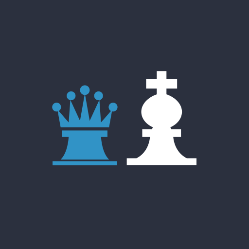

<p align="center">
  
</p>

# Chessomnia

**A chess board for two people sharing one tablet. Not a chess computer.**

Chessomnia replaces the physical board when you don't have one to hand. Two players
sit opposite each other, the tablet lies flat on the table between them, and they play
the way they would on wood and felt — except the app knows the rules.

There is **no computer opponent, no position evaluation and no move suggestion**. That is
a deliberate product decision, not a missing feature. The app knows the rules; it does
not know strategy.

[](LICENSE)
[](#building)

---

## What it does

- **Complete FIDE rules** — castling, en passant, promotion, checkmate, stalemate, the
  fifty-move rule, threefold repetition and dead positions.
- **Learning aid** — tap a piece and every legal move for it is marked, including the
  special moves beginners overlook.
- **Two-sided layout** — clock, status line and buttons exist twice, once at each table
  edge. The upper player's panel and pieces are drawn rotated 180°, so both players read
  their own material the right way up.
- **A clock that informs rather than judges** — it counts *upward*, measuring how long
  each player has thought in total. It never runs out and never ends a game.
- **Take back a move** — a takeback restores the position *and* the clock in one step.
  There is deliberately no "resign" and no "offer a draw": nothing is recorded anywhere,
  so how a game ends makes no difference. Leave to the menu and start a new one.
- **Survives everything** — the running game outlives a trip to the menu, a rotation and
  an app restart.

### What it deliberately does not do

No engine. No move list or SAN notation. No PGN export. No opening book. No online play.

## Why you might want it

- **Free, ad-free, tracking-free.** No advertising SDK, no analytics, no crash reporting,
  no account. Nothing is uploaded, ever.
- **Fully offline.** The release build requests **zero Android permissions** — not even
  `INTERNET`. You can verify that yourself in [`AndroidManifest.xml`](android-app/app/src/main/AndroidManifest.xml).
- **Not a chess computer.** If you want an opponent or an evaluation bar, this is the
  wrong app, and happily so.

## Privacy

The short version: the app collects nothing and sends nothing. Everything it stores —
your settings and the game in progress — stays in the app's own private storage on the
device.

The one thing that can leave the device is a bug report, and only when you explicitly
share it: "Report a problem" builds a plain-text description of the position and hands it
to Android's share sheet. You choose where it goes, and you see the text first.

Full statement: [PRIVACY.md](PRIVACY.md).

## Design decisions worth knowing

These follow from one premise — *the tablet lies flat on the table between two people*:

- **The board never rotates automatically.** One player sees it upside down, exactly as at
  a real board. That is the point, not a defect. "Swap colours" turns the board 180° so
  nobody has to pick the tablet up.
- **Dialogs turn to face whoever asked.** A promotion dialog in a fixed orientation would
  be unreadable for one of the two players every time. Every prompt therefore carries the
  player who triggered it.
- **The end of the game does not cover the board.** Result and reason appear in the two
  panels at the table edges. When you have just been mated you want to see *why* — the
  highlighted king and the marked last move are the answer, and nothing may hide them.
- **Captured pieces sit on the side of the player who took them**, with the *net* material
  advantage. A plain sum would be misleading: trading queens would read "+9".

More, including the reasoning behind the rules engine, in [ARCHITECTURE.md](ARCHITECTURE.md).

## How correctness is ensured

A hand-written test only checks a hand-written engine against its author's own
assumptions, so there are three independent layers:

1. **Perft** against the six published standard positions. Depth 3 on every build,
   depth 4–5 behind a flag (12.4 million nodes, exact). This exhausts move generation.
2. **Cross-check against [python-chess](https://github.com/niklasf/python-chess)** —
   4,576 positions with their full legal-move list and game status, generated by a
   *foreign* implementation. Deliberately dense around endings: 756 checkmates,
   420 stalemates, 400 dead positions, 29 fifty-move draws. Random games alone almost
   never reach mate, and without mates the corpus would not answer the question that
   matters.
3. **Invariants over random games** — after every halfmove the tracked king square is
   checked against a board scan and `isInCheck` against a brute-force test. This targets
   the one bug that would silently turn a checkmate into a *stalemate*.

A by-product of introducing layer 2: of ten hand-written "mate positions" in the test
suite, **five were not mates**. The engine had been right every time. Hand-written test
data is the least reliable source in chess.

## Building

Requires **JDK 17** and the Android SDK.

```bash
cd android-app
./gradlew assembleDebug        # debug APK
./gradlew test                 # 95 unit tests, about a second
./gradlew test -DperftDeep=1   # plus the deep perft runs (12.4M nodes)
```

The release build is minified and shrunk. To sign it, copy
[`android-app/keystore.properties.example`](android-app/keystore.properties.example) to
`keystore.properties` and fill it in; without that file the release build is simply left
unsigned, which is what a fork or a CI check wants.

```bash
./gradlew bundleRelease        # Android App Bundle
```

Cutting an actual release — versioning, the checks that catch a build which
succeeds but is wrong, and the Play Console steps — is written up in
[RELEASING.md](RELEASING.md).

| | |
|---|---|
| Language / UI | Kotlin 2.2, Jetpack Compose, Material 3 |
| AGP / Gradle | 8.13.2 / 8.14.5 |
| SDK | `minSdk 30` (Android 11), `compileSdk`/`targetSdk` 36 |
| Dependencies | Compose, Navigation, Lifecycle ViewModel, kotlinx.serialization. No Room, no WorkManager, no Google Play Services |

## Project layout

```
android-app/app/src/main/java/name/lechners/chessomnia/
├── rules/       Rule engine. Pure Kotlin, no Android imports, fully unit-testable
├── game/        A game in progress: move history, takeback, clock
├── data/        Settings, persistence, bug report
└── ui/          Compose: board, panels, overlays, screens
tools/           Generators for the icon, the wordmark, the piece drawables and the test corpus
licenses/        Full licence texts of everything third-party
```

## Licence

The code is **Apache-2.0** — see [LICENSE](LICENSE) and [NOTICE](NOTICE).

Third-party content, all of it reproduced in full under [`licenses/`](licenses) and shown
in the app under *Settings → About → Show licenses*:

| What | Origin | Licence |
|---|---|---|
| Chess pieces | Staunton set by Colin M. L. Burnett ("Cburnett"), Wikimedia Commons | BSD 3-Clause¹ |
| Wordmark | Set in [Montserrat](https://github.com/JulietaUla/Montserrat) by Julieta Ulanovsky et al. | SIL OFL 1.1² |
| App icon and mark | Original work — king and queen, generated by `tools/generate_app_icon.py` | Apache-2.0 |
| Libraries | AndroidX, Jetpack Compose, Kotlin, kotlinx.serialization | Apache-2.0 |

¹ Cburnett offers the set under GFDL, CC BY-SA 3.0, BSD 3-Clause and GPL 2+ with an
explicit free choice. Chessomnia elects BSD 3-Clause: attribution stays required, but
share-alike does not apply.

² Only the letter outlines are used; the font file itself is not redistributed. Under the
OFL, a document set with a font is not itself subject to the OFL.

## Contributing

Bug reports are especially welcome — the in-app *Report a problem* button produces exactly
the text needed to reproduce a position. See [CONTRIBUTING.md](CONTRIBUTING.md).

Please note the scope: pull requests that add an engine, an evaluation or move suggestions
will be declined, however well written. That boundary is the product.
